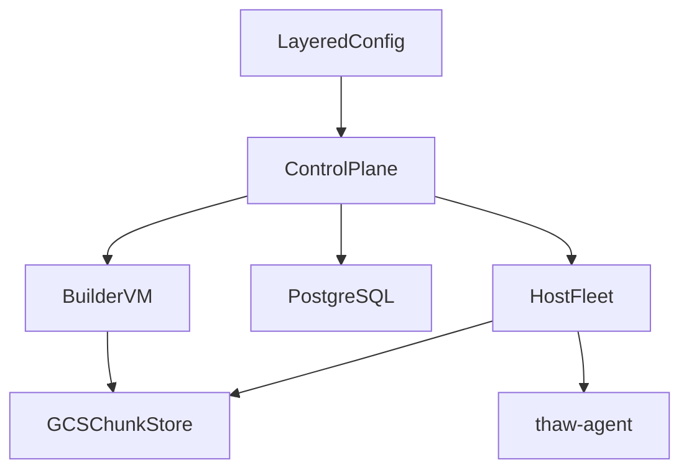

<p align="center">
  
</p>

# Generic Workload Platform on Firecracker

Snapshot-first Firecracker microVM platform for fast-start sandboxes, resumable
sessions, and general-purpose workload execution.

## Status

This repository implements a **generic workload platform**. The control plane
manages layered configs, launches snapshot-builder VMs, allocates workload-keyed
microVMs onto a host fleet, and can pause/resume session state through GCS-backed
diff snapshots.

Current alpha scope:

- Supported deployment: `GCP + Firecracker + Helm`
- Network model: private-network-first control plane with bearer-token API auth
- Python SDK is a tier-1 surface
- API and SDK are alpha and may break before `v1`
- Host images are built separately from the tagged release flow

The canonical GCP path is the unified `onboard.yaml` flow documented in
[docs/setup.md](docs/setup.md).

## What This Is

The platform snapshots Firecracker microVMs and restores them on demand with lazy
loading:

- Memory is restored through UFFD-backed page fault handling.
- Disk is restored through FUSE-backed chunk loading.
- Snapshot chunks are content-addressed and shared across workloads in GCS.
- Hosts keep warm pools of paused VMs for fast same-host reuse.
- Session-backed workloads can pause dirty state to GCS and resume on another host.

The current API surface is built around **layered configs**:

- `base_image` defines the workload root filesystem.
- `layers` define the warmup/build chain baked into snapshots.
- `start_command` defines the service or runner process launched after restore.
- `workload_key` identifies the leaf snapshot used for scheduling, pooling, and rollout.

## Architecture



At a high level:

- `cmd/control-plane` stores layered configs, enqueues builds, tracks desired snapshot
  versions, and allocates workload instances.
- `cmd/firecracker-manager` runs on each GCE host VM and restores or resumes microVMs.
- `cmd/thaw-agent` runs inside the guest and handles warmup mode, `start_command`,
  exec/file APIs, and post-resume reconfiguration.
- `cmd/snapshot-builder` builds chunked snapshots from a Docker base image plus warmup
  commands.
- `sdk/python` provides the cleanest current client API for layered-config registration
  and sandbox allocation.

See [docs/architecture.md](docs/architecture.md) for the current code-grounded design.

## How It Works

1. Register a layered config with `base_image`, `layers`, `config`, and `start_command`.
2. The control plane materializes the layer chain, computes the leaf `workload_key`, and
   stores config metadata in PostgreSQL.
3. A build request launches a nested-virtualization builder VM that runs
   `cmd/snapshot-builder`.
4. The builder creates chunked snapshot metadata in GCS and updates
   `current-pointer.json` for the leaf `workload_key`.
5. Hosts heartbeat to the control plane, learn desired versions, and lazily sync
   manifests for workload keys they need.
6. An allocation request either resumes a paused session, reuses a pooled VM, or restores a
   fresh microVM from the chunked snapshot.
7. Inside the guest, `thaw-agent` reads MMDS, configures networking, launches the
   `start_command`, and exposes the in-VM debug/exec/file APIs.

## Use Cases

- AI sandboxes with session resume across conversation turns.
- Dev environments with pre-warmed toolchains and editor services.
- Long-lived service workloads with pooled microVM reuse.
- CI workloads where the platform-specific behavior is just a `start_command`.

The workload primitives are documented in [examples/README.md](examples/README.md).

## Quickstart

1. Copy and edit the root config:

```bash
cp onboard.yaml my-config.yaml
# edit platform.gcp_project and workload settings
```

2. Preview the actions:

```bash
make onboard-plan CONFIG=my-config.yaml
```

3. Run the full deployment:

```bash
make onboard CONFIG=my-config.yaml
```

4. The onboard flow bootstraps infra with zero hosts, builds the host image, deploys the
   control plane, stages builder artifacts, registers/builds the layered workload config,
   finalizes Terraform against the real control-plane address, and verifies allocation.

If you want to work with the control-plane API directly, register a layered config like
this:

```bash
cat > layered-config.json <<'EOF'
{
  "display_name": "hello-service",
  "base_image": "ubuntu:22.04",
  "layers": [
    {
      "name": "runtime",
      "init_commands": [
        {"type": "shell", "args": ["bash", "-lc", "apt-get update && apt-get install -y python3"]}
      ]
    }
  ],
  "config": {
    "tier": "m",
    "auto_pause": true,
    "ttl": 300,
    "auto_rollout": true
  },
  "start_command": {
    "command": ["python3", "-m", "http.server", "8080"],
    "port": 8080,
    "health_path": "/"
  }
}
EOF

curl -sS -X POST "http://CONTROL_PLANE:8080/api/v1/layered-configs" \
  -H "Content-Type: application/json" \
  --data @layered-config.json
```

3. Trigger a build, wait for the leaf layer to become active, then allocate a runner with
   the returned `leaf_workload_key`.

If you prefer a client library, see [sdk/python/README.md](sdk/python/README.md).

## Examples

The `examples/` directory shows intended workload shapes for CI, AI sandboxes, dev
environments, and storage-heavy workloads.

Those example `onboard.yaml` files are executable inputs for `make onboard` as long as
you stay within the currently supported schema:

- `platform`
- `microvm`
- `hosts`
- `workload.base_image`
- `workload.layers`
- `workload.config`
- `workload.start_command`
- `session`

See [examples/README.md](examples/README.md) for the shared primitives and example map.

## Development

```bash
make dev-setup
make build
make test-unit
make check
make lint
```

See [docs/DEV_SETUP.md](docs/DEV_SETUP.md) for local development details.

## Docs

- [docs/architecture.md](docs/architecture.md) - current runtime architecture
- [docs/setup.md](docs/setup.md) - supported GCP deployment path from zero
- [docs/HOWTO.md](docs/HOWTO.md) - operational recipes
- [docs/operations.md](docs/operations.md) - build, rollout, and failure-handling details
- [examples/README.md](examples/README.md) - workload primitives and example mapping
- [sdk/python/README.md](sdk/python/README.md) - client SDK

## License

Apache 2.0
