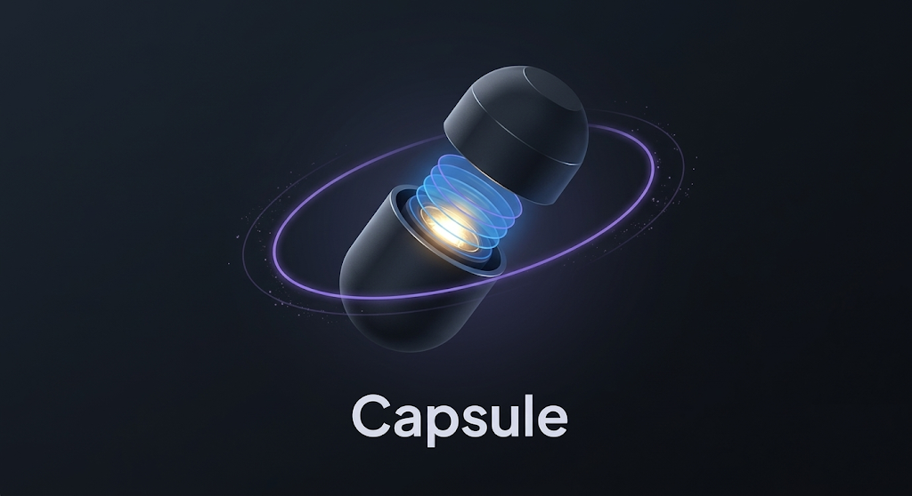
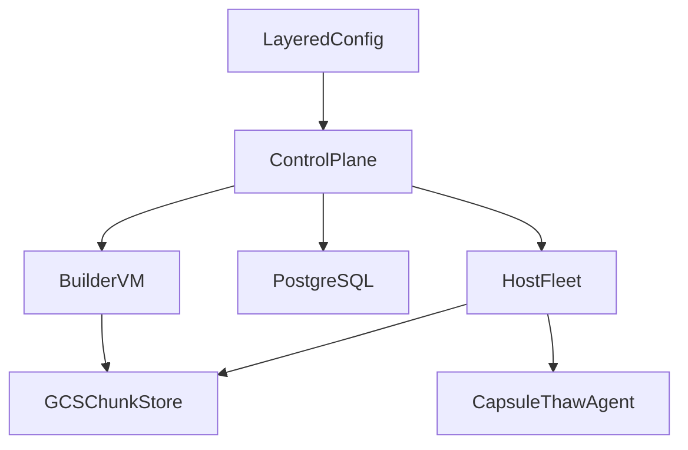

<p align="center">
  
</p>

# Capsule

[](https://github.com/rahul-roy-glean/bazel-firecracker/actions/workflows/ci.yaml)
[](https://github.com/rahul-roy-glean/bazel-firecracker/actions/workflows/release.yaml)

Capsule is a snapshot-first workload platform built on Firecracker. It lets you
pre-build microVM images, restore them quickly, and optionally preserve
session state across allocations.

## Status

Capsule is currently alpha software.

- Supported deployment path: `GCP + Firecracker + Helm`
- Primary client surface: Python SDK in `sdk/python`
- Auth model: bearer-token API auth for control-plane requests
- Stability: API, SDK, and deployment surfaces may change before `v1`

If you want the supported zero-to-live path, start with [docs/setup.md](docs/setup.md).

## Why Capsule

Capsule is designed for workloads that benefit from warm, reusable runtime state
without giving up VM-level isolation.

- Fast restore from pre-built Firecracker snapshots
- Layered build model for predictable, content-addressed workload versions
- Warm pool reuse for low-latency repeated allocations
- Session pause and resume across hosts using GCS-backed state
- Generic workload model that works for services, CI runners, dev environments,
  and interactive sandboxes

## Core Concepts

- `base_image`: the Docker image Capsule converts into a Firecracker guest rootfs
- `layers`: warmup/build steps that run during snapshot creation
- `start_command`: the process Capsule launches after restore
- `workload_key`: the stable key derived from the final layer hash and used for
  scheduling, pooling, and rollout
- `session_id`: the identifier used to resume a paused VM state across requests

## Quickstart

The recommended path is the unified `onboard.yaml` workflow.

1. Copy the default config.

```bash
cp onboard.yaml my-config.yaml
```

2. Edit at least:

- `platform.gcp_project`
- `platform.region`
- `platform.zone`
- `workload.base_image`
- `workload.layers`
- `workload.start_command`

3. Preview the deployment.

```bash
make onboard-plan CONFIG=my-config.yaml
```

4. Apply it.

```bash
make onboard CONFIG=my-config.yaml
```

The onboard flow bootstraps infrastructure, builds the host image, deploys the
control plane, stages builder artifacts, registers the workload, builds the
snapshot chain, and verifies allocation.

For prerequisites, expected output, and troubleshooting, see
[docs/setup.md](docs/setup.md).

## First Workload Example

Most users should interact with Capsule through the Python SDK rather than
hand-writing HTTP requests.

```python
from capsule_sdk import CapsuleClient, RunnerConfig

cfg = (
    RunnerConfig("hello-service")
    .with_base_image("ubuntu:22.04")
    .with_commands(["apt-get update", "apt-get install -y python3"])
    .with_tier("m")
    .with_auto_pause(True)
    .with_ttl(300)
)

with CapsuleClient(base_url="http://localhost:8080", token="my-token") as client:
    workload = client.workloads.onboard(cfg)
    with client.workloads.start(workload) as runner:
        output, code = runner.exec_collect("python3", "-c", "print('hello')")
        print(output, code)
```

See [sdk/python/README.md](sdk/python/README.md) for a full SDK walkthrough and
[docs/HOWTO.md](docs/HOWTO.md) for lower-level API recipes.

## Architecture At A Glance



At runtime:

- `cmd/capsule-control-plane` manages layered configs, builds, fleet state, and
  allocation
- `cmd/capsule-manager` runs on each host VM and restores or resumes microVMs
- `cmd/capsule-thaw-agent` runs inside the guest and handles warmup, networking,
  exec, PTY, file APIs, and `start_command`
- `cmd/snapshot-builder` builds chunked snapshots from a Docker base image plus
  warmup commands

For the detailed design, see [docs/architecture.md](docs/architecture.md).

## Documentation

- [docs/setup.md](docs/setup.md) - deploy Capsule on GCP from zero
- [docs/HOWTO.md](docs/HOWTO.md) - common API and operational recipes
- [docs/operations.md](docs/operations.md) - runtime behavior, rollout, and recovery
- [docs/architecture.md](docs/architecture.md) - component model and data flows
- [docs/DEV_SETUP.md](docs/DEV_SETUP.md) - local development and contribution workflow
- [examples/README.md](examples/README.md) - example index and shared workload primitives
- [sdk/python/README.md](sdk/python/README.md) - Python SDK guide

## Examples

The `examples/` directory contains deployable workload configs for common
Capsule use cases:

- AI sandboxes
- Persistent dev environments
- Git-backed CI runners
- Bazel and Buildbarn-backed workloads
- AFS-style sandbox services

Use [examples/README.md](examples/README.md) to pick the closest starting point.

## Development

```bash
make dev-setup
make build
make test-unit
make check
make lint
```

See [docs/DEV_SETUP.md](docs/DEV_SETUP.md) for local setup, testing, and
contribution details.

## Contributing

Contributions are welcome. If you are changing runtime behavior, deployment
assets, or the public SDK, start with [docs/DEV_SETUP.md](docs/DEV_SETUP.md) and
run the relevant local checks before opening a change.

## License

Apache 2.0
