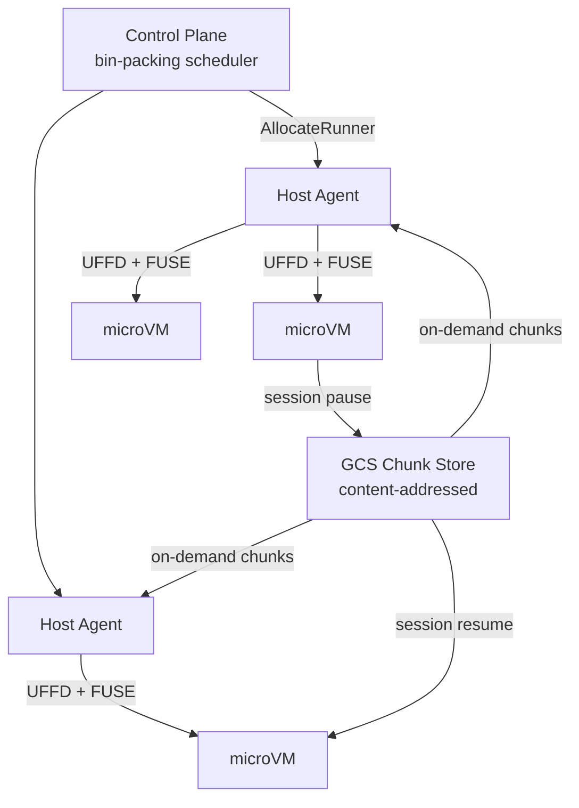

<p align="center">
  
</p>

# bazel-firecracker

Sub-second VM restore with content-addressed lazy loading.

## What this is

bazel-firecracker is a platform for snapshotting Firecracker microVMs and restoring them
on any host in under 500ms. A golden snapshot is chunked into a content-addressed store;
on restore, memory is demand-paged via Linux UFFD and disk is lazily loaded via FUSE -- the
VM is running before most of its data has been transferred. Identical chunks are stored
once and shared across all snapshots and workloads, so a fleet of hundreds of VMs can
share a single pool of chunks.

Session snapshots let a paused VM resume exactly where it left off, on any host in the
fleet, with only dirty pages transferred. The control plane bin-packs VMs across GCE hosts
with a warm pool, autoscaling, and canary rollouts for snapshot updates. CI is one
supported use case; the platform is general-purpose.

## How it works

1. **Golden snapshot** -- boot a Firecracker microVM, run warmup commands (e.g. pull
   dependencies, warm a JVM), take a Firecracker snapshot.
2. **Chunk into CAS** -- split the snapshot memory and disk into fixed-size content-addressed
   chunks and upload to GCS. A manifest records hashes, offsets, and sizes.
3. **Restore via UFFD + FUSE** -- on allocate, start a UFFD handler for memory and mount
   a FUSE filesystem for disk. Resume the VM immediately; pages and disk blocks are fetched
   on demand from the chunk store as the guest accesses them.
4. **Session pause** -- when a VM is paused, only dirty memory pages (found via
   `SEEK_DATA`/`SEEK_HOLE`) are uploaded as a new chunk layer on top of the golden snapshot.
5. **Session resume** -- to resume, download the session manifest, layer UFFD handlers
   (golden + session diff), and resume the VM. Works cross-host.

## Use cases

### AI agent sandboxes

Run a Python interpreter or tool-use environment inside a pre-warmed VM. Pause between
conversation turns -- the full memory state is preserved. Resume in under 500ms, on any
host, with all local state intact.

```json
{
  "start_command": {
    "command": ["python3", "-m", "http.server", "8080"],
    "port": 8080,
    "health_path": "/health"
  }
}
```

### CI runners

GitHub Actions jobs get a fresh microVM pre-warmed with the full build environment --
analysis graph, fetched externals, live Bazel server -- in under a second.

```yaml
jobs:
  build:
    runs-on: [self-hosted, firecracker]
    steps:
      - uses: actions/checkout@v4
      - run: bazel build //...
```

### Dev environments

Provision pre-warmed development environments with all dependencies installed.
Resume a suspended environment in under 500ms from any host -- no cold-start wait,
no re-downloading packages.

```json
{
  "start_command": {
    "command": ["/usr/local/bin/code-server", "--bind-addr", "0.0.0.0:8080"],
    "port": 8080,
    "health_path": "/healthz"
  }
}
```

### Serverless functions

Keep a warm pool of VMs running your HTTP service. Pool reuse delivers ~10ms response
latency for repeat requests; cold restores from the chunk store take ~200-400ms.

```json
{
  "start_command": {
    "command": ["./my-service", "--port", "8080"],
    "port": 8080,
    "health_path": "/ready"
  }
}
```

## Performance

| Operation | Latency |
|---|---|
| VM restore (UFFD + FUSE) | ~200-400ms |
| Pool reuse (same host) | ~10ms |
| Session resume (cross-host) | ~300-500ms |
| Session pause | ~500ms-2s |

## Architecture



See [docs/architecture.md](docs/architecture.md) for full diagrams and component breakdown.

## Getting started

Deploy the control plane to GKE, provision host VMs, and allocate your first microVM:

```bash
cp onboard.yaml my-config.yaml
# edit my-config.yaml
make onboard CONFIG=my-config.yaml
```

See [docs/DEV_SETUP.md](docs/DEV_SETUP.md) for local development setup and
[docs/setup.md](docs/setup.md) for a full production deployment guide.

### For CI (GitHub Actions)

```yaml
jobs:
  build:
    runs-on: [self-hosted, firecracker]
    steps:
      - uses: actions/checkout@v4
      - run: bazel build //...
```

### For generic workloads

Allocate a VM with a `StartCommand` via the control plane API:

```bash
curl -X POST https://control-plane/api/v1/runners \
  -H 'Content-Type: application/json' \
  -d '{
    "chunk_key": "my-snapshot-key",
    "start_command": {
      "command": ["./my-service", "--port", "8080"],
      "port": 8080,
      "health_path": "/ready"
    }
  }'
```

## Development

```bash
make dev-setup   # install toolchain deps
make build       # build all binaries
make test-unit   # unit tests (macOS + Linux)
make check       # build + unit tests (pre-commit)
make lint
```

See `make help` for the full list of targets. Integration tests require Linux + KVM
(`make test-integration`).

## Docs

- [docs/architecture.md](docs/architecture.md) -- system design and component breakdown
- [docs/DEV_SETUP.md](docs/DEV_SETUP.md) -- local development setup
- [docs/HOWTO.md](docs/HOWTO.md) -- operational guides
- [docs/operations.md](docs/operations.md) -- day-to-day ops and runbooks
- [bazel-firecracker-rfc.md](bazel-firecracker-rfc.md) -- original design RFC

## License

Apache 2.0
