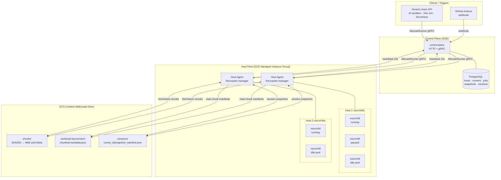
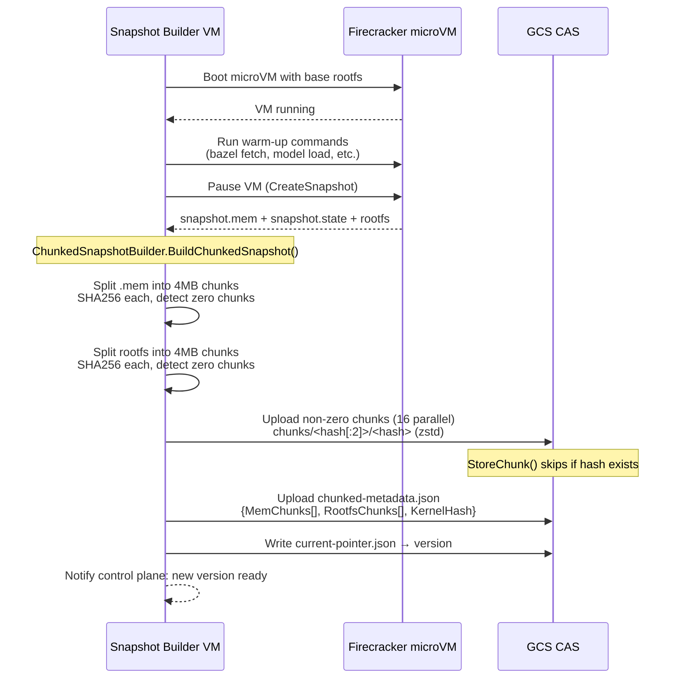
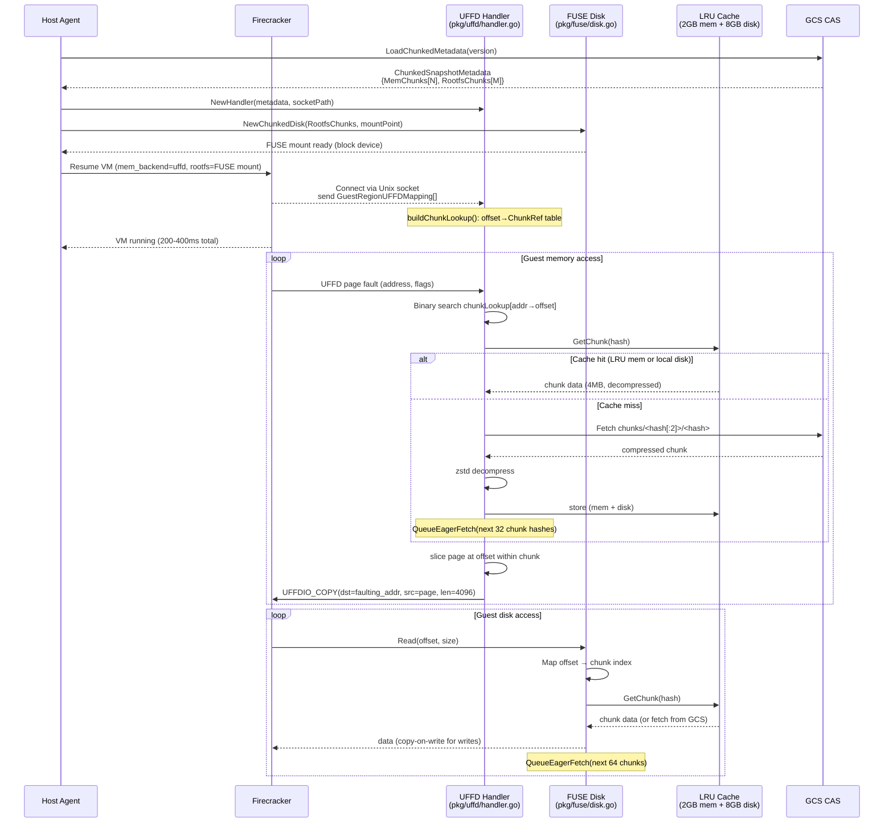
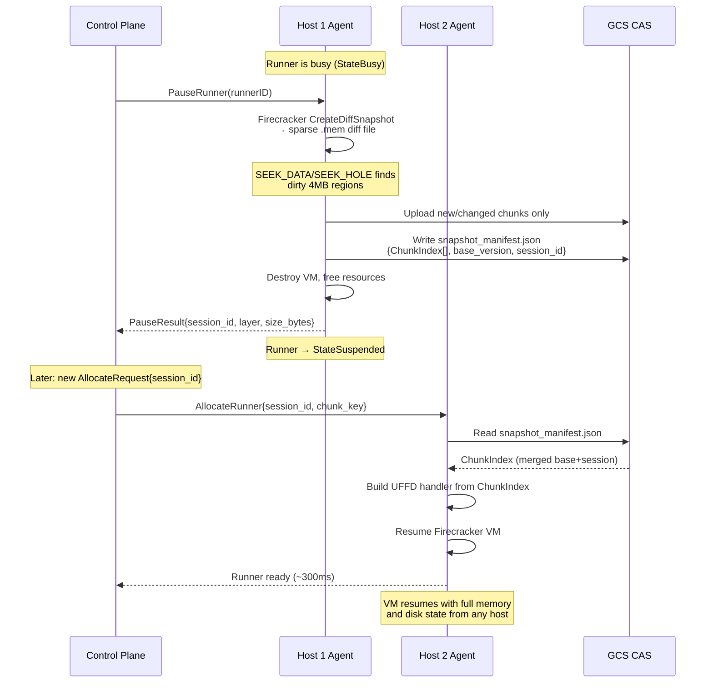
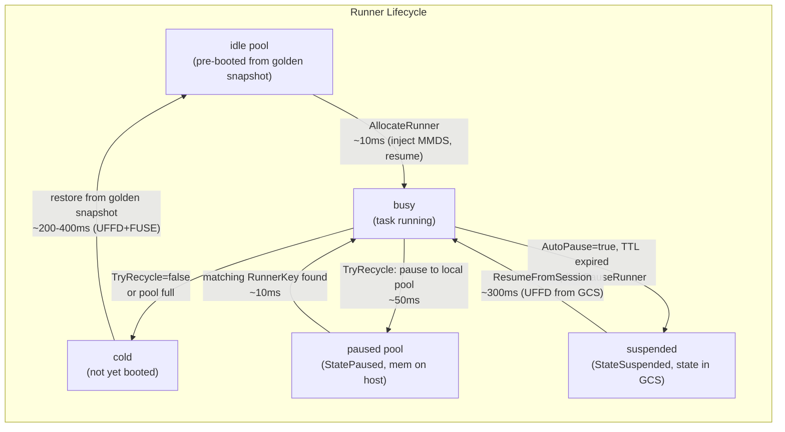
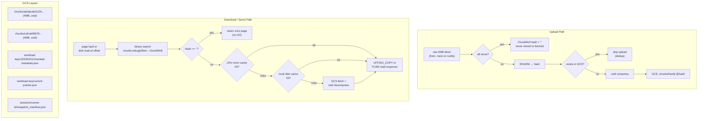
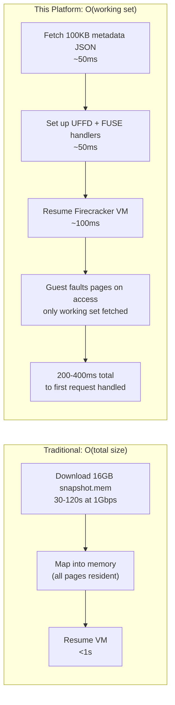
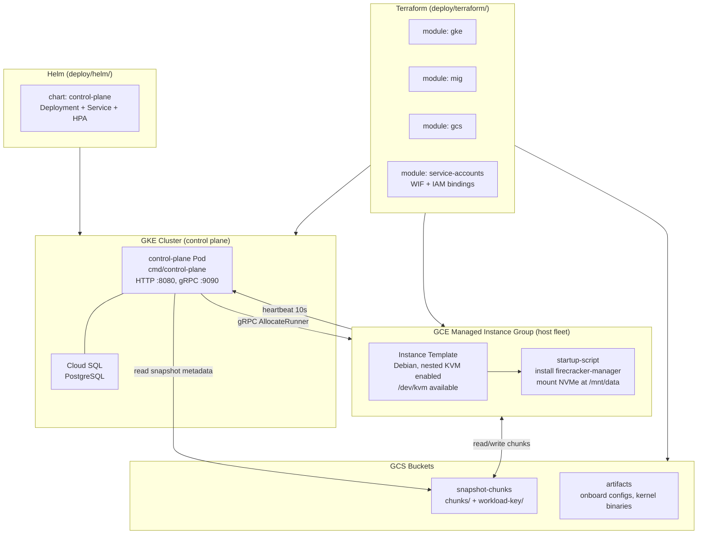

# Sub-Second VM Snapshot/Restore Platform

**One line:** A content-addressed, lazy-loading VM snapshot platform that restores any Firecracker microVM in 200–400ms regardless of memory size, with persistent sessions and cross-host mobility.

---

## Summary

This platform snapshots a running Firecracker microVM — memory, CPU state, and disk — chunks the result into 4MB SHA256-keyed blocks, compresses and uploads them to GCS, and restores the VM on any host in under half a second. The key insight is that restoring a VM does not require loading its memory upfront. Memory pages are served on demand via Linux userfaultfd (UFFD): the guest faults, the handler fetches the right 4MB chunk from GCS or local cache, and serves the 4KB page — all within the guest's fault window. The rootfs is served identically via a FUSE virtual block device with copy-on-write semantics. A fleet orchestration layer on GKE handles scheduling, autoscaling, warm pool management, and rolling snapshot version upgrades. CI (GitHub Actions) is implemented as one adapter on top of a generic workload API; the same platform equally serves AI sandboxes, dev environments, and serverless functions.

---

## The Problem

Every workload that needs an isolated execution environment faces the same fundamental tradeoff: isolation costs startup time.

| Approach | Startup Time | Isolation | State Preserved |
|---|---|---|---|
| Shared process | ~0ms | None | Yes |
| Container (cold) | 1–5s | Namespace | No |
| GCE VM (cold) | 30–120s | Full | No |
| GCE VM + PD snapshot | 10–30s | Full | Disk only |
| K8s VolumeSnapshot | 6–23s | Full | Disk only |

The core problems with existing approaches:

**Cold starts are O(total size), not O(working set.** A 16GB VM takes 16GB of I/O to start, regardless of how little of that memory is actually touched in the first few seconds of execution.

**Snapshots capture disk, not memory state.** GCE disk snapshots and Kubernetes VolumeSnapshots only preserve storage. A Bazel build server's in-memory analysis graph, a Python interpreter's loaded modules, or a running database's buffer pool are all lost. The next job pays the full warm-up cost again.

**Zone-locked mobility.** GCE disk snapshots are zonal. A scheduler cannot freely place workloads across zones or regions.

**No content deduplication.** Ten snapshots of slightly different versions of the same base image store ten copies of the base. Storage and transfer costs scale linearly with the number of workloads.

---

## Architecture Overview



---

## How It Works

### 1. Golden Snapshot Creation

A snapshot builder VM boots a fresh Firecracker microVM, runs the workload-specific warm-up (e.g., `bazel fetch //...`, pre-loading model weights, or pre-installing packages), then takes a Firecracker full snapshot. The resulting `.mem` and `.state` files are chunked and uploaded to GCS.



**Zero-chunk optimization:** All-zero 4MB blocks (sparse VM memory regions) are detected with a SIMD-accelerated `bytes.Equal` against a zero reference. Their `ChunkRef.Hash` is set to `""` (sentinel). They are never uploaded, never fetched — readers return a zero-filled buffer directly. This can eliminate 60–80% of chunks for a freshly warmed VM.

**Content deduplication:** `StoreChunk()` checks GCS object existence before uploading. If the hash already exists — because another workload or version shares that chunk — the upload is skipped entirely. A fleet of 100 hosts with 10 workload types shares one set of chunks in GCS.

---

### 2. Fast Restore: UFFD + FUSE Lazy Loading

The critical path on restore is: fetch the 100KB metadata JSON, set up UFFD and FUSE handlers, resume Firecracker. The VM is running in ~200ms. Memory and disk pages are fetched on demand as the guest accesses them.



**Why resume latency is O(working set), not O(VM size):**

A 16GB VM with a 400MB working set (pages actually touched in the first 5 seconds) makes approximately 100 chunk fetches at ~4MB each. Chunks are fetched in parallel by 64 eager prefetch workers rate-limited to 5000 fetches/sec. The VM is unblocked by each UFFDIO_COPY within microseconds of the page being available. Total resume latency to "service handling its first request" is 200–400ms rather than the O(16GB) = ~30s it would take to download the full snapshot.

**Eager prefetch:** On each cache miss, the UFFD handler queues the next 32 chunk hashes (by snapshot file offset) to the background prefetch stack. The FUSE disk queues the next 64. This hides GCS latency for sequential access patterns, which are dominant during startup.

---

### 3. Session Pause and Cross-Host Resume

A running VM can be paused at any time: Firecracker creates a diff snapshot (sparse file) containing only dirty pages since the last snapshot. The host uses `SEEK_DATA`/`SEEK_HOLE` to find dirty regions, merges them with the base chunk index, uploads only new chunks to GCS, and writes a session manifest. The VM can be resumed on any host in the fleet.



**Incremental layers:** Each pause adds a layer. The `SessionMetadata.Layers` counter tracks depth. The session manifest contains the merged chunk index (base golden snapshot chunks overridden by session-specific dirty chunks). Resume always reads a single flat chunk index regardless of how many pause/resume cycles have occurred.

---

### 4. Pool Reuse: Instant Same-Host Resume

When a runner finishes a task, instead of destroying the VM, the host pauses it into an in-memory pool. The next task with a matching `RunnerKey` (same snapshot version, platform, labels) resumes the paused VM in ~10ms — no GCS fetch required.



**Pool constraints:** `PoolConfig` enforces `MaxTotalMemoryBytes` (default 20GB) and `MaxRunnerMemoryBytes` (default 2GB) per runner. The LRU eviction policy ensures the pool does not consume unbounded host RAM. When the pool is full, the oldest paused runner is destroyed rather than a new one being rejected.

---

## The CAS Architecture

All snapshot content flows through one content-addressed store. The same physical GCS objects are shared across workloads, snapshot versions, and session layers.



**Cache hierarchy (per host):**

| Layer | Size | Access Time | Scope |
|---|---|---|---|
| In-memory LRU (decompressed) | 2GB | ~100ns | Per-host, all VMs |
| Local NVMe disk cache (compressed) | 8GB | ~100µs | Per-host, all VMs |
| GCS (compressed) | Unlimited | ~10-50ms | Global |

Chunks are stored compressed on disk and in GCS; the in-memory cache holds decompressed chunks for zero-copy serving into UFFDIO_COPY. A 4MB chunk decompresses to exactly 4MB (or less for the last chunk), covering 1024 x 4KB pages.

---

## Performance Architecture

Resume latency is independent of VM memory size. Here is why:



For a 16GB VM with a 400MB startup working set:

- **Traditional download:** 16GB / 1Gbps = ~128 seconds
- **This platform:** ~100 chunk fetches × ~5ms/chunk (parallel) = ~500ms for working set, overlapped with execution

**Pool reuse path (same host):** The VM state is already mapped in host memory from the previous pause. Resume is a Firecracker `Resume` call with memory already resident — approximately 10ms.

**Session resume path (cross-host):** The merged chunk index is fetched from GCS (~50ms). UFFD handler is set up. VM resumes and begins executing immediately. Pages are fetched on demand. First-request latency is ~300ms for a typical 4GB VM.

---

## Use Cases

The generic workload model uses `StartCommand` to describe any service to run inside the VM:

```go
// pkg/snapshot/start_command.go
type StartCommand struct {
    Command    []string `json:"command"`
    Port       int      `json:"port"`
    HealthPath string   `json:"health_path"`
}
```

The thaw agent starts `Command` after restore, waits for `GET HealthPath` on `Port` to return 2xx, then signals readiness. The host proxies traffic through to `Port`.

### AI Sandboxes

Run untrusted code (LLM-generated or user-submitted) in a hardware-isolated microVM. Each sandbox gets a fresh VM from a pre-warmed snapshot with the model weights and runtime pre-loaded.

```yaml
start_command:
  command: ["python3", "/app/sandbox_server.py"]
  port: 8080
  health_path: "/health"
```

- Snapshot includes: Python runtime, model weights in `/app/`, CUDA libraries
- Each sandbox: fresh microVM, ~300ms to ready, full KVM isolation
- After use: pause to pool (10ms resume for next request) or destroy
- Session persistence: a sandbox's state can be paused and resumed for multi-turn conversations

### CI Runners (GitHub Actions)

The original use case. A `ci.Adapter` implements the GitHub Actions runner registration protocol on top of the generic runner API. The snapshot contains a fully warmed Bazel build environment.

```yaml
runs-on: [self-hosted, firecracker]
```

- Snapshot includes: running Bazel server, analysis graph, fetched externals, action cache
- Each CI job: fresh microVM from snapshot, ~200ms to runner registration
- Pool reuse: if a paused VM exists for the same repo/version, resume in ~10ms
- Multi-repo: each repo has its own snapshot; chunks are shared across repos

### Dev Environments

A developer requests a pre-built IDE environment. The snapshot contains the workspace, LSP servers, and toolchain all pre-warmed against the current main branch.

```yaml
start_command:
  command: ["/usr/bin/code-server", "--auth=none", "--port=8443"]
  port: 8443
  health_path: "/healthz"
```

- Session ID bound to user — `AutoPause=true`, `TTLSeconds=3600`
- Session persists across browser closes (pause on idle, resume on reconnect)
- Cross-host resume: scheduler can place the session on any host with capacity

### Serverless Functions

Functions are snapshotted with their runtime and dependencies pre-initialized. Cold start is the time to restore from the golden snapshot; warm start is pool reuse.

```yaml
start_command:
  command: ["/app/function-runtime", "--handler=handler.main"]
  port: 3000
  health_path: "/ready"
```

- Golden snapshot: Node.js/Python/Go runtime + dependencies installed and initialized
- Cold start: ~200ms (vs. 1–5s for container cold start)
- Warm start (pool reuse): ~10ms
- Scale-to-zero: paused VMs use minimal resources; no billing while suspended

---

## Comparison Table

| | This Platform | GCS Tarball | K8s VolumeSnapshot | gVisor Checkpoint | CRIU | E2B | Lambda SnapStart |
|---|---|---|---|---|---|---|---|
| Resume latency | **200–400ms** | O(data size) | 6–23s | 500ms–2s | 500ms–5s | ~300ms | ~200ms |
| Same-host pool reuse | **~10ms** | N/A | N/A | N/A | N/A | Unknown | N/A |
| Memory state preserved | Yes | No | No | Yes | Yes | Yes | Yes (JVM only) |
| Disk state preserved | Yes (COW) | Partial | Yes | Yes | Yes | Yes | No |
| Content deduplication | Yes (SHA256 CAS) | No | No | No | No | Unknown | No |
| Cross-host mobility | Yes (GCS) | Yes | No (zonal) | No (source-host UFFD) | Limited | Yes | No |
| Lazy loading (UFFD) | Yes | No | No | Experimental | Partially | Yes (presumed) | Unknown |
| Incremental sessions | Yes (diff snapshots) | No | No | No | No | Unknown | No |
| Open source | Yes | N/A | Yes | Yes | Yes | No | No |
| Hypervisor | Firecracker (KVM) | Any | Any | gVisor | Linux | Firecracker | Firecracker |
| Cloud | GCP (GCS) | Any | Any | Any | Any | Proprietary | AWS |

**Notes:**
- CRIU lazy page server depends on the source host remaining accessible; this platform serves all pages from GCS.
- gVisor checkpoint UFFD support is experimental as of 2025; no production-grade CAS layer.
- E2B uses a similar architecture (Firecracker + GCS-backed snapshots) but is proprietary with no published CAS implementation.
- Lambda SnapStart is JVM-only, no persistent sessions, AWS-only.

---

## Deployment Model



**Infrastructure components:**

- **GKE:** Control plane runs as a single Deployment (stateless, Postgres-backed). Horizontal Pod Autoscaler scales on request rate.
- **GCE MIG:** Host fleet as a Managed Instance Group with autoscaling. Instance template enables nested KVM (`/dev/kvm`) and mounts a local NVMe disk at `/mnt/data` for the chunk cache and session directories.
- **GCS:** One bucket for content-addressed chunks (versioned, with lifecycle rules for GC). Objects are globally accessible; the CAS means any host can serve any workload.
- **Cloud SQL:** PostgreSQL for control plane state. All tables are in `pkg/db/schema.sql`.
- **Workload Identity Federation:** Host agents authenticate to GCS via WIF (no long-lived service account keys).

**Onboarding:** The `onboard` tool (`make onboard CONFIG=my-config.yaml`) automates the full infrastructure setup: Terraform apply, service account creation, snapshot builder VM provisioning, first snapshot build, and control plane deployment.

---

## Requirements and Constraints

**Hard requirements:**
- Linux kernel 5.4+ with KVM support (`/dev/kvm`) on host VMs
- Nested virtualization enabled (GCE: `--enable-nested-virtualization`)
- FUSE kernel module (`fusermount3`)
- GCS access (bucket for CAS + session snapshots)

**Current limitations:**
- Storage backend: GCS only (CAS interface is internal; S3 backend is straightforward to add)
- Platform: Linux/amd64 only (UFFD and FUSE code is gated on `//go:build linux`; stub files exist for macOS builds/tests)
- Hypervisor: Firecracker only (architecture is hypervisor-agnostic above the `pkg/firecracker` abstraction layer, but no other hypervisor adapter exists today)

**Not required:**
- Container runtime (no Docker, no containerd)
- Kubernetes on hosts (host agent is a standalone binary)
- Persistent storage per VM (rootfs is ephemeral COW overlay; session state lives in GCS)
