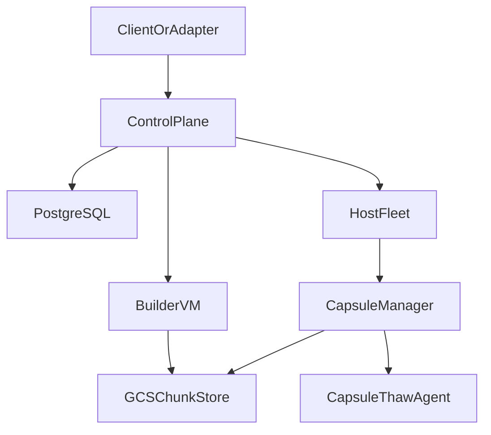
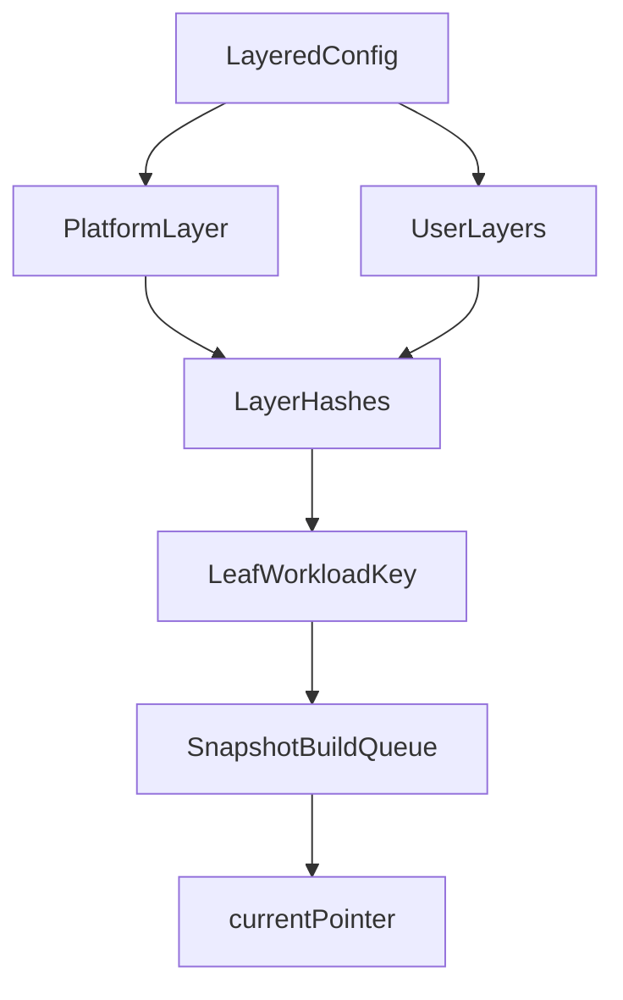
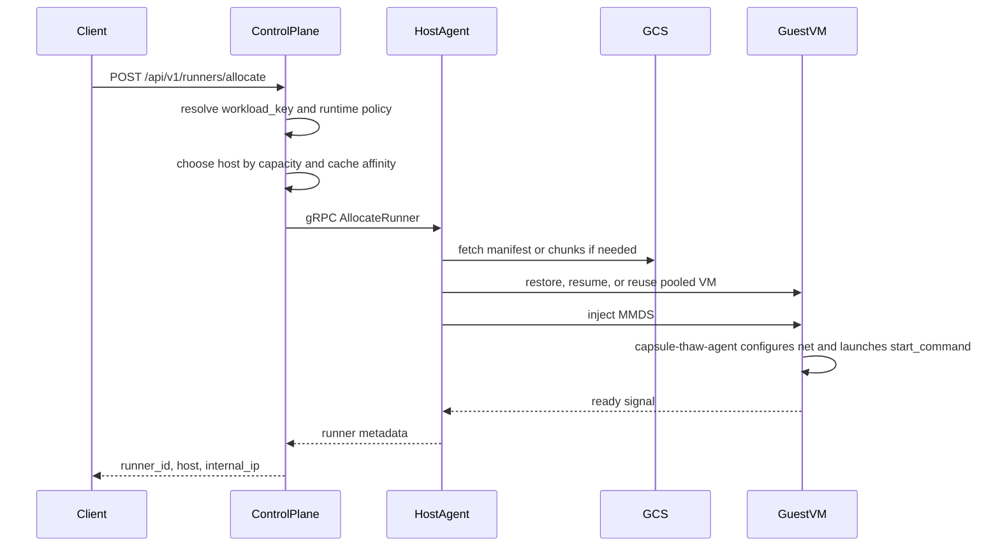
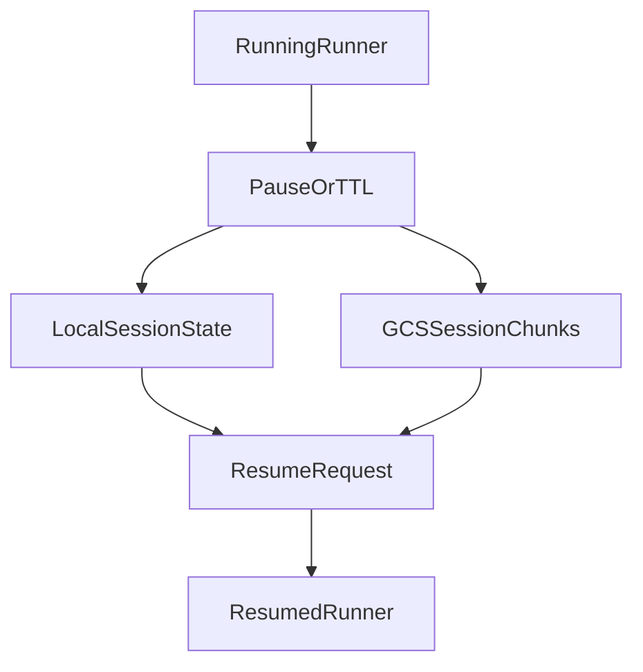

# Architecture

This document explains the current Capsule runtime model: how workloads are
defined, how snapshots are built, how runners are allocated, and how state is
preserved across sessions.

## System Model

Capsule is built around four ideas:

- workloads are declared as layered configs
- builders materialize those configs into snapshot artifacts
- host agents restore or resume Firecracker microVMs from those artifacts
- guest agents finish runtime setup and launch the user process

CI runners, dev environments, and sandbox services are built on top of those
same primitives rather than through workload-specific schedulers.

## Glossary

- `layered config`: the declarative workload definition registered with the control plane
- `layer`: a warmup/build step baked into the snapshot chain
- `workload_key`: the stable identifier derived from the final layer hash
- `session snapshot`: paused VM state that can be resumed later, optionally on a different host
- `MMDS`: Firecracker metadata service used to pass runtime configuration into the guest

## Topology

## Core Components

### Control Plane

`cmd/capsule-control-plane` is the source of truth for:

- layered config registration and lookup
- snapshot build queue management
- runner allocation and reconnect APIs
- workload version convergence across hosts
- session bookkeeping
- optional MCP exposure on top of the same runtime primitives

Durable state is stored in PostgreSQL. Key tables include:

- `layered_configs`
- `snapshot_layers`
- `snapshot_builds`
- `snapshots`
- `version_assignments`
- `hosts`
- `runners`
- `session_snapshots`

### Host Agent

`cmd/capsule-manager` runs on each GCE host VM. It:

- heartbeats host state to the control plane
- syncs manifests for the workload keys it needs
- restores or resumes Firecracker microVMs
- reuses paused VMs from the local pool when possible
- exposes host-side proxy endpoints for service, exec, PTY, and file access

### Guest Agent

`cmd/capsule-thaw-agent` runs inside the guest and owns post-boot or post-resume
runtime setup. It:

- reads MMDS metadata written by the host
- configures networking and clock state
- executes warmup commands during snapshot creation
- launches the configured `start_command`
- serves in-guest health, exec, PTY, and file APIs

### Snapshot Builder

`cmd/snapshot-builder` runs on nested-virtualization builder VMs. It can:

- convert a Docker `base_image` into a guest rootfs
- run warmup commands inside a Firecracker VM
- capture memory and disk state as chunked snapshot artifacts
- reuse parent layers and stale-check the platform layer for faster rebuilds

## Layered Config Lifecycle

The runtime configuration model is defined in `pkg/snapshot/layer_config.go`.

Important rules:

- `base_image` introduces an implicit platform layer
- each layer hash depends on its parent hash, commands, and drive specs
- the final layer hash becomes the stable `workload_key`
- when the leaf build completes, Capsule updates the workload-key alias and
  `current-pointer.json` in GCS

## Allocation Lifecycle

Allocation behavior in practice:

- the control plane resolves tier, TTL, auto-pause, start command, and network policy
- host choice prefers session stickiness and cache affinity when possible
- the host may return a pooled VM, resume a suspended session, or restore from snapshot
- readiness is driven by the guest agent's health signaling

## Session Lifecycle

Session state is tracked in `session_snapshots` and implemented by host-side
pause and resume logic in `pkg/runner/session.go`.

Capsule supports two resume modes:

- same-host resume from local disk state
- cross-host resume from GCS-backed chunked state with UFFD and FUSE-backed lazy loading

The control plane tracks ownership and scheduling state, but the actual pause
and resume operations happen on the host agents.

## Optional Adapters

The runtime itself is generic. Repository-level adapters currently include:

- the Python SDK, which wraps layered config registration and runner lifecycle APIs
- the MCP server, which exposes sandbox-oriented tools on top of the same primitives

These adapters are clients of the runtime, not special-case branches in the
core architecture.

## Deployment Notes

The supported deployment flow is the `onboard.yaml` path described in
[setup.md](setup.md).

Capsule still accepts some legacy-style wrapper inputs such as
`workload.snapshot_commands`, but the long-term architecture centers on the
layered workload model described above.
