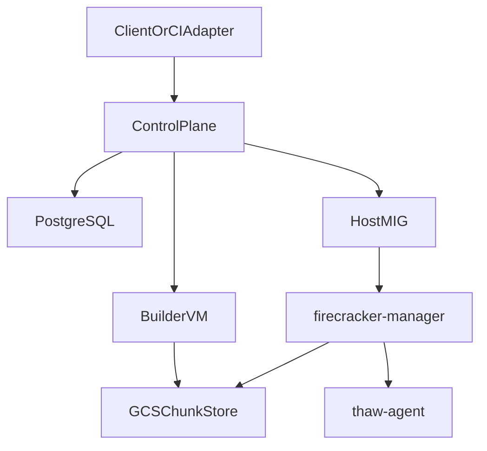
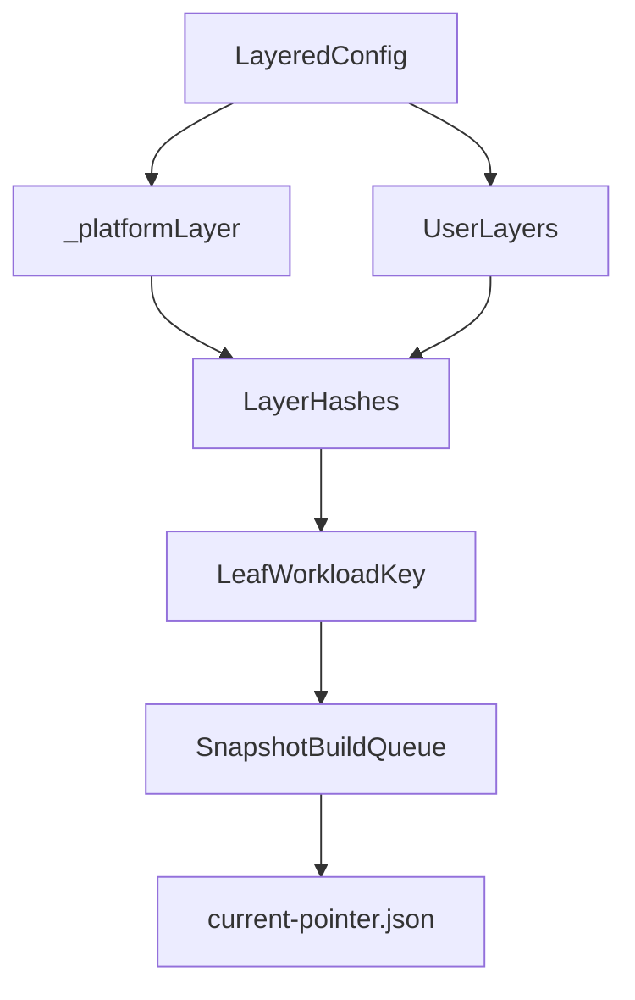
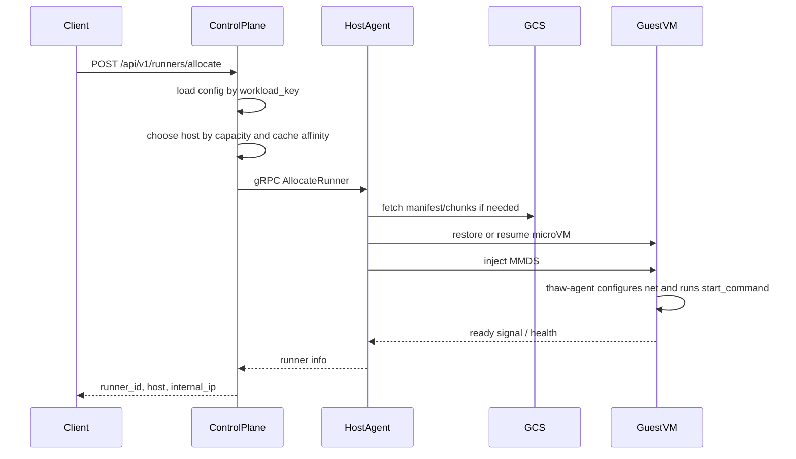
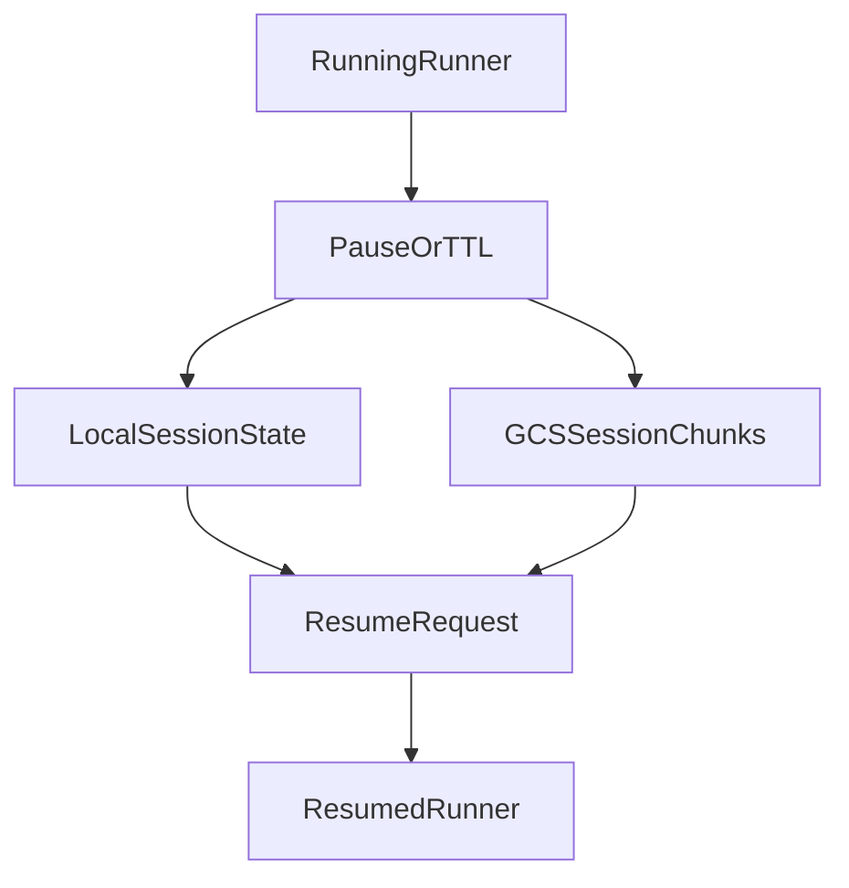

# Architecture

`bazel-firecracker` currently implements a generic Firecracker runtime platform:

- the control plane stores and builds **layered workload configs**
- hosts restore microVMs by **workload key**
- the guest agent runs a user-defined **start command**
- optional **session pause/resume** preserves dirty state across hosts
- CI integrations are adapters layered on top, not the core abstraction

## System Topology

## Core Components

### Control Plane

`cmd/control-plane` runs in GKE and is the source of truth for:

- layered config registration at `/api/v1/layered-configs`
- build queue management for snapshot layers
- runner allocation at `/api/v1/runners/allocate`
- session-aware reconnect/pause/resume APIs
- workload version convergence via `/api/v1/versions/*`
- optional MCP server exposure for sandbox orchestration

Its durable state lives in PostgreSQL. Important tables are:

- `layered_configs`
- `snapshot_layers`
- `snapshot_builds`
- `snapshots`
- `version_assignments`
- `hosts`
- `runners`
- `session_snapshots`

### Host Agent

`cmd/firecracker-manager` runs on each GCE host VM in the managed instance group. It:

- heartbeats host state to the control plane
- lazily syncs manifests for desired workload keys
- restores microVMs from chunked snapshots
- reuses paused VMs from the local pool when possible
- pauses and resumes session runners
- exposes the host-side proxy for exec, PTY, file, and service access

### Guest Agent

`cmd/thaw-agent` is PID 1-or-near-PID-1 inside the guest and drives lifecycle after boot
or restore. It:

- reads MMDS for network, runtime, and session metadata
- configures networking and clock sync after restore
- runs warmup commands during snapshot building
- starts the user `start_command` after restore
- serves health, warmup status, exec, PTY, and file APIs inside the guest

### Snapshot Builder

`cmd/snapshot-builder` runs on a nested-virtualization builder VM. It can:

- build a rootfs from `base_image`
- run warmup commands inside a Firecracker guest
- take a snapshot and chunk memory/disk into GCS-backed content-addressed storage
- reuse parent layers and incremental session state for faster rebuilds

## Layered Config Lifecycle

The current configuration model is defined in `pkg/snapshot/layer_config.go`.

The important rules are:

- `base_image` causes an implicit `_platform` layer to be prepended.
- each layer hash includes its parent hash, commands, and drive specs.
- the leaf layer hash is converted into a stable `workload_key`.
- leaf completion creates the workload-key alias in GCS and updates
  `current-pointer.json`.

This is the runtime model the control plane actually understands today.

## Allocation Lifecycle

Key details from the current implementation:

- the scheduler resolves `tier`, `start_command`, TTL, auto-pause, and network policy
  from `layered_configs`
- session-aware allocation first tries to route back to the original host
- if no sticky host is available, host choice falls back to workload-key cache affinity
- the host agent may return an already-running session, resume a suspended one, reuse a
  paused pool entry, or restore from chunked snapshot data

## Session Lifecycle

Session state is managed by `pkg/runner/session.go` and `session_snapshots`.

There are two resume modes:

- same-host/local resume from on-disk session state
- cross-host resume from GCS-backed session manifests plus UFFD/FUSE lazy loading

The control plane tracks session ownership in `session_snapshots`, but the actual pause
and resume work happens on host agents.

## Optional Adapters

The runtime is generic, but the repository still contains workload-specific adapters:

- the Python SDK wraps layered config registration and runner lifecycle calls
- the MCP server exposes sandbox tools on top of the same allocate/pause/resume/exec
  primitives

These sit on top of the workload-key model; they are not the core architecture.

## Deployment Reality

The current repository has two different eras of deployment/configuration surfaces:

- the **current runtime** is the layered workload system described above
- the **legacy onboarding surface** still assumes older `snapshot_commands`-style configs

For an actual deployment, follow [docs/setup.md](setup.md). That guide is the canonical
`onboard.yaml`-driven path for wiring up the current runtime on GCP.
