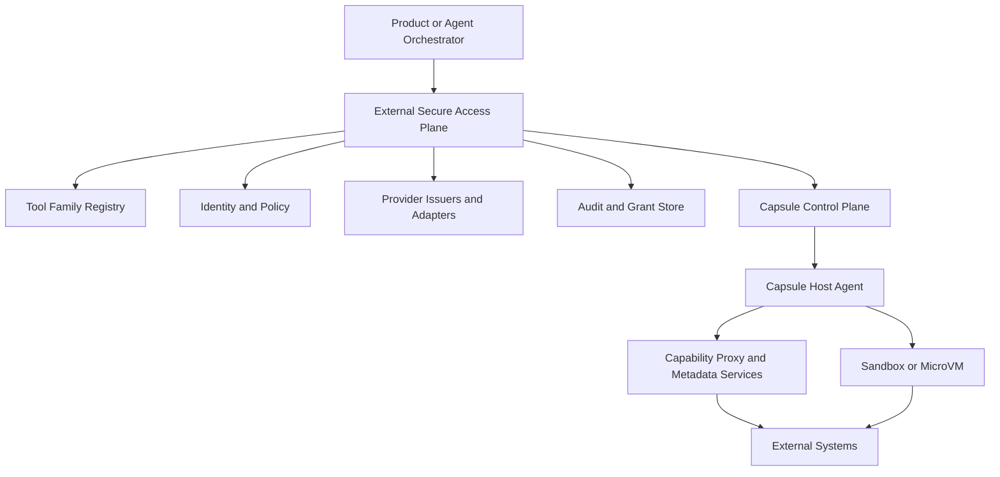
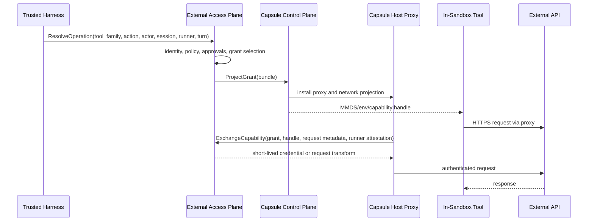
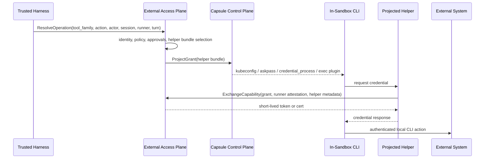

# Capsule Secure Access Plane: General Design Proposal

This document proposes a concrete, reviewable design for a **general Capsule
secure access plane** that is **externalized from the core runtime**.

It builds on the earlier strategy documents:

- [secure-access-plane-future.md](secure-access-plane-future.md)
- [secure-access-plane-one-pager.md](secure-access-plane-one-pager.md)

Unlike those documents, this one is implementation-oriented. It focuses on:

- what should live in the external access-plane service
- what Capsule should continue to own inside this repository
- how tools declare auth and execution requirements
- how those requirements are registered and evaluated
- what the supported tool-surface axes are
- what a realistic Phase 1 should include

## Status

This is a design proposal for critical review. It is intentionally concrete, but
it is not an implementation plan frozen to current code.

## Executive Summary

The general Capsule secure access plane should be an **external service** that
acts as the semantic authority for:

- identity
- policy
- approvals
- grants
- audit
- provider-specific credential issuance
- tool family registration
- delivery-lane selection

Capsule itself should remain focused on being the **runtime substrate**:

- sandbox and runner lifecycle
- workload attestation
- dynamic network policy
- host-side capability proxy
- helper projection into the guest
- lifecycle notifications for pause, resume, fork, and migration

The most important design rule is:

> Provider-specific auth logic should not live in Capsule runtime code by
> default. Capsule should expose generic delivery mechanisms; the external
> access plane should decide what to deliver and when.

This proposal recommends a **layered registry model** rather than a pure plugin
system inside Capsule:

1. **Tool family manifests** define semantics, supported lanes, destinations,
   auth patterns, and approval defaults.
2. **Access-plane adapters** implement provider-specific issuance and refresh
   outside Capsule.
3. **Capsule runtime adapters** remain generic and limited:
   - capability proxy injection
   - metadata emulation
   - helper bundle projection
   - dynamic network policy

This model avoids turning Capsule into a provider-auth monolith while still
allowing the access plane to support a broad tool surface.

## Core Design Decisions

### 1. The access plane is external to this repository

The access plane should live in a separate service and, likely, a separate
repository.

Reasons:

- it separates provider-specific auth from Capsule's VM and host logic
- it allows independent review, deployment, and policy control
- it prevents runtime code from accumulating cloud and SaaS auth complexity
- it makes it easier to add approvals, audit, and identity features without
  entangling the Capsule scheduler or guest agent

### 2. Capsule owns delivery hooks, not semantic policy

Capsule should continue to own:

- runner creation and lifecycle
- MMDS injection
- host-side proxy and metadata emulation
- network policy updates
- helper file and env projection
- session lifecycle events

Capsule should not be the place where the system decides:

- which human identity is in effect
- which virtual identity is selected
- whether a write needs approval
- how to mint a GitHub App token
- how to impersonate a GCP service account
- how to refresh an OAuth token

### 3. Treat the current auth proxy as a runtime data-plane primitive

This repository already contains useful runtime primitives:

- `pkg/authproxy` provides host-side HTTPS proxying with SSL bump
- providers can inject credentials into matching hosts
- metadata emulation exists for GCP-style auth
- MMDS projection already injects proxy address, CA cert, metadata host, and
  env placeholders into the guest
- dynamic network policy already exists

Those primitives are valuable, but they currently mix two layers:

- **generic data-plane behaviors**
- **provider-specific issuance**

This proposal separates those concerns.

## Responsibilities Split

### External access plane owns

- identity resolution
- actor and virtual identity mapping
- policy evaluation
- HITL and approvals
- grant creation and revocation
- tool family registry
- provider-specific issuers
- helper bundle rendering
- remote execution, if and when implemented
- audit and analytics

### Capsule runtime owns

- attested runner identity
- host/runner lifecycle
- network and proxy projection
- helper file projection
- guest bootstrap
- lifecycle event emission
- low-level enforcement and traffic mediation

## Architecture Overview



### Interpretation

- the **external access plane** is the semantic authority
- Capsule is the runtime control plane and delivery substrate
- the host-side proxy and helper projection are generic execution mechanisms
- external systems only see credentials and identities chosen by the access
  plane

## External Access Plane APIs

The access plane should expose a small set of explicit APIs.

### 1. `ResolveOperation`

Used by trusted harnesses or orchestration layers before an effect is executed.

Input should include:

- actor context
- session_id
- runner_id
- turn_id
- tool_family
- logical action
- desired target
- local fidelity requirement
- whether writes are involved

Output:

- allow or deny
- selected delivery lane
- grant ID
- delivery bundle reference
- approval requirement or approval result

### 2. `ProjectGrant`

Used by the access plane to tell Capsule what to install for a runner.

This should not contain long-lived provider secrets. It should contain a
generic **projection bundle**.

### 3. `ExchangeCapability`

Used by runtime-side proxies or helper shims to exchange:

- runner attestation
- grant ID
- capability handle
- request metadata

for:

- a short-lived credential
- a signed header
- a request transform
- a metadata response
- a helper credential payload

### 4. `RefreshGrant`

Used by long-running helper sessions or proxies when a short-lived credential is
close to expiry.

### 5. `RevokeGrant`

Used by:

- the product layer
- lifecycle event processors
- policy or approval engines
- incident response systems

### 6. `PublishRunnerEvent`

Used by Capsule to publish lifecycle changes:

- runner allocated
- runner released
- session paused
- session resumed
- session forked
- host draining
- grant projection removed

These events are essential for revocation and audit correctness.

## Capsule Runtime Contract

To keep the access plane externalized cleanly, Capsule should expose a stable
runtime integration contract.

### 1. Runner Attestation

Each runner needs an attested identity that the external access plane can trust.

Recommended fields:

- runner_id
- session_id
- workload_key
- host_id
- issued_at
- expires_at
- boot_epoch
- policy_version

Recommended format:

- signed JWT in Phase 1, because it is simple and reviewable
- SPIFFE or mTLS-based workload identity can be considered later

### 2. Projection Bundle

The access plane should never hand Capsule a provider-specific opaque blob and
expect ad hoc interpretation.

Instead, it should hand Capsule a typed **projection bundle**.

Example logical shape:

```yaml
grant_id: grant_123
lane: direct_http_proxy
expires_at: 2026-03-17T12:00:00Z
audit:
  tool_family: github-rest
  action: create-issue
  actor_user: alice@example.com
  virtual_identity: eng-prod-readonly
network:
  domains:
    - api.github.com
  methods:
    - POST
  paths:
    - /repos/acme/api/issues
proxy:
  allowed_hosts:
    - api.github.com
  handles:
    - env_name: GH_TOKEN
      value: cap://grant_123/gh
      inject_header: Authorization
      inject_prefix: "Bearer "
helper: null
metadata: null
```

The important point is that this bundle carries **delivery instructions**, not
provider-specific auth logic.

### 3. Dynamic Policy Update Hook

Capsule already exposes dynamic network policy updates. Phase 1 should reuse
that.

Longer term, the runtime needs richer controls than domain/CIDR only:

- domain allowlists
- destination ports
- optional method/path restrictions
- optional per-binary restrictions
- explicit TTL and revocation association

This is where OpenShell-like policy ideas are relevant, though they do not need
to be adopted wholesale in Phase 1.

### 4. Helper Projection Hook

Capsule should support projecting:

- files
- env vars
- helper binaries or symlinks
- askpass scripts
- exec plugin configs
- `credential_process` configs
- kubeconfigs

into the guest at runtime, without rebuilding the snapshot.

### 5. Lifecycle Event Stream

Capsule should publish lifecycle transitions to the access plane so grants can
be revoked and correlated correctly.

## Tool Model

The access plane needs a first-class model for **tool families**.

The registry should not treat each binary or each API endpoint as a bespoke
special case.

Instead, it should define **tool families** with shared semantics.

Examples:

- `github-rest`
- `github-git`
- `generic-http-bearer`
- `gcp-adc`
- `kubectl`
- `aws-cli`
- `internal-admin-api`
- `internal-admin-cli`

### Tool family manifest

Each tool family should register a declarative manifest.

Example:

```yaml
name: github-rest
version: v1
kind: api
logical_actions:
  - list-repos
  - read-issue
  - create-issue
  - merge-pr
supported_lanes:
  - direct_http_proxy
  - remote_execution
auth_patterns:
  - github_app_installation
destinations:
  - host: api.github.com
    protocol: https
request_rules:
  - action: list-repos
    methods: [GET]
    paths: ["/user/repos", "/orgs/*/repos"]
  - action: create-issue
    methods: [POST]
    paths: ["/repos/*/*/issues"]
approval_hints:
  read_actions:
    default: auto
  write_actions:
    default: policy
execution_hints:
  local_fidelity_required: false
  supports_proxy_injection: true
  supports_helper_mode: false
binary_matchers:
  - /usr/bin/curl
  - /usr/bin/gh
```

This manifest is intentionally declarative. It should not contain provider
secrets or platform-specific code.

## Tool Auth Declaration Model

This is the central design question: how do tools declare their auth
requirements?

The proposal recommends a **three-layer model**.

### Layer 1: Declarative tool manifests

Every tool family declares:

- transport shape
- logical actions
- destinations
- approval defaults
- supported lanes
- compatible auth patterns
- whether local fidelity matters
- whether helper projection is needed

This should be the default path for the majority of tools.

### Layer 2: Access-plane adapter services

Some auth patterns are too dynamic for a manifest alone.

Examples:

- GitHub App installation token minting
- GCP service-account impersonation
- OAuth refresh-token exchange
- AWS STS assume-role
- internal identity-provider ticket exchange

Those should live in **access-plane-owned adapter services**, not inside
Capsule.

Each adapter service implements a stable contract such as:

- `IssueCredential`
- `RefreshCredential`
- `BuildHelperBundle`
- `BuildProxyTransform`
- `BuildMetadataResponse`

### Layer 3: Runtime delivery adapters

Capsule only needs generic runtime adapters:

- delegated-header injection
- delegated-basic-auth injection
- metadata service emulation
- helper bundle projection
- capability-handle validation
- optional remote-execution dispatch hook in the future

This keeps provider-specific auth logic out of the runtime.

## Why Not a Pure Plugin System Inside Capsule

Several alternatives are possible. They are not equally desirable.

### Option A: In-process runtime plugins inside Capsule

Pros:

- flexible
- powerful
- single deployment surface

Cons:

- versioning pain
- unsafe trust boundary
- ties provider-auth complexity to runtime releases
- difficult to reason about in critical review

This proposal does **not** recommend in-process auth plugins inside Capsule.

### Option B: WASM plugins inside the access plane

Pros:

- better isolation than native plugins
- potentially useful for deterministic transforms

Cons:

- still operationally complex
- poor fit for adapters that need network access, long-lived refresh, or
  provider SDKs

WASM may be useful later for narrow transform logic, but it should not be the
primary extension mechanism.

### Option C: Code/skill distribution like NanoClaw

NanoClaw is useful as a reference because it distinguishes:

- operational skill distribution
- runtime registries

But its branch and skill model is a **distribution and customization** strategy,
not a runtime auth architecture.

The useful takeaway is:

- keep operational instructions and marketplace concerns separate from runtime
  auth composition

The non-takeaway is:

- do not use git-merge skills as the primary runtime access-plane extension
  mechanism

### Recommended option: declarative manifests plus out-of-process adapters

This gives the best balance of:

- reviewability
- explicit semantics
- externalization from Capsule
- runtime safety
- provider-specific flexibility

## Recommended Delivery Lanes

The general access plane should support three lanes, even if Phase 1 ships only
a subset.

### Lane 1: Direct HTTP capability lane

This is the preferred lane for HTTP-centric tools where direct local execution
matters and auth can be mediated at the boundary.

Mechanics:

- access plane issues a short-lived grant
- Capsule projects a capability proxy configuration into the runner
- sandbox sees a capability handle or placeholder env value, not a durable real
  secret
- host proxy exchanges or injects credentials at request time

This is the strongest candidate for early adoption because Capsule already has
runtime pieces for it.

#### Direct HTTP capability flow



### Lane 2: Local helper session lane

This is the preferred lane for CLI families that need local fidelity and do not
fit pure HTTP substitution.

Mechanics:

- access plane issues a helper grant
- Capsule projects helper files and env into the guest
- local CLI invokes helper binary, `credential_process`, `askpass`, or exec
  plugin
- helper exchanges runner attestation for short-lived credential material

This lane is necessary for a real general access plane, but should remain
narrowly scoped.

#### Local helper session flow



### Lane 3: Remote execution lane

This remains part of the architecture, but it should live entirely in the
external access plane and can be deferred if Phase 1 needs to stay narrow.

Use cases:

- non-HTTP admin CLIs
- high-risk write operations
- tools whose auth chains are too complex to support locally
- tools whose blast radius is too large for ambient local capability handles

## Runtime Data Plane Inside Capsule

The runtime should evolve around generic delivery mechanisms.

### Capability proxy

The existing `pkg/authproxy` is a strong base. Over time it should be narrowed
to generic runtime behaviors:

- proxy requests
- optionally SSL-bump matching hosts
- validate capability handles
- request short-lived upstream credentials or transforms from the external
  access plane
- inject headers or basic auth
- emulate metadata where configured

The runtime should stop owning provider-specific secret fetching over time.

### Generic runtime provider types

The following generic runtime provider types are reasonable:

- `delegated-header`
- `delegated-basic-auth`
- `delegated-api-key`
- `metadata-emulator`
- `askpass-helper`
- `credential-process-helper`
- `exec-plugin-helper`

These are delivery behaviors, not product integrations.

### What should move out of runtime

The following current patterns should move into the external access plane over
time:

- fetching bearer tokens from Secret Manager
- minting GitHub App installation tokens
- impersonating GCP service accounts
- any provider-specific refresh logic

## Support Matrix by Tool Surface Axis

The access plane should classify tools on several axes.

| Axis | Values | Why it matters |
| --- | --- | --- |
| Surface | API, CLI, SDK, metadata-driven, helper-driven, non-HTTP | determines delivery lane |
| Local fidelity | low, medium, high | determines whether remote execution is acceptable |
| Auth shape | bearer, API key, metadata, helper, signed request, mTLS | determines adapter type |
| Risk | read-only, write, prod-impacting | drives approvals and default lane |
| Sandboxed authority exposure | none, capability handle, helper-visible short-lived credential | drives risk posture |
| Destination control | fixed host, host family, dynamic host | drives policy shape |

## Concrete Examples

The examples below intentionally cover:

- API vs CLI
- no remote execution needed vs remote execution preferred
- multiple auth shapes

### Category A: API, no remote execution needed

#### Example A1: GitHub REST issue creation

Tool family:

- `github-rest`

Why local execution is acceptable:

- request is HTTPS
- auth is GitHub App installation token or delegated OAuth token
- local code may want to assemble payload from workspace context

Recommended lane:

- direct HTTP capability lane

Flow:

1. Agent requests `create-issue` against repo `acme/api`.
2. Access plane resolves actor, virtual identity, approval policy, and scope.
3. Access plane selects `direct_http_proxy`.
4. Access plane projects:
   - network rules for `api.github.com`
   - request rules for `POST /repos/acme/api/issues`
   - env handle such as `GH_TOKEN=cap://grant_123/github`
5. Local `gh` or `curl` runs in the sandbox.
6. Host proxy intercepts the request, exchanges the capability handle for a
   short-lived installation token, injects the `Authorization` header, and
   forwards upstream.
7. Audit records actor, repo, action, grant, and result.

#### Example A2: Internal search API read

Tool family:

- `internal-search-api`

Why local execution is acceptable:

- standard HTTPS API
- read-only operation
- no tool-specific local helper needed

Recommended lane:

- direct HTTP capability lane

Flow is similar to A1, but the auth adapter may simply mint a short-lived
bearer token from an internal identity provider instead of a GitHub token.

### Category B: API, remote execution preferred or required

#### Example B1: Production admin mutation API

Tool family:

- `internal-admin-api`

Why remote execution is preferred:

- high blast radius
- approval semantics matter more than local fidelity
- strongest audit boundary is desired

Recommended lane:

- remote execution

If remote execution is not implemented in Phase 1, this family should be marked
unsupported instead of weakened into local direct access.

#### Example B2: mTLS-protected internal API

Tool family:

- `internal-mtls-api`

Why remote execution may be required:

- client cert handling
- request signing
- difficult local debugging and certificate hygiene

Recommended lane:

- remote execution, or a later specialized local delivery adapter

### Category C: CLI, no remote execution needed

#### Example C1: `kubectl apply -f generated.yaml`

Tool family:

- `kubectl`

Why remote execution is not ideal:

- command depends on workspace-local manifests
- local fidelity is important

Recommended lane:

- local helper session

Flow:

1. Agent requests `apply-manifest` on cluster `staging-cluster`.
2. Access plane verifies policy and approval.
3. Access plane issues a helper grant and builds a kubeconfig bundle.
4. Capsule projects:
   - kubeconfig
   - helper binary or helper command
   - env such as `KUBECONFIG=/tmp/capsule/kubeconfig`
5. Local `kubectl` calls the exec plugin helper.
6. Helper presents runner attestation plus grant ID to the access plane.
7. Access plane returns a short-lived cluster token or client cert.
8. `kubectl` talks to the API server using local manifests.

#### Example C2: `git push` over HTTPS

Tool family:

- `github-git`

Why remote execution is not ideal:

- command depends on local git state
- local refs and workspace matter

Recommended lane:

- local helper session

Mechanics:

- access plane projects `GIT_ASKPASS` or a git credential helper
- helper uses runner attestation plus grant ID to fetch a short-lived token
- token is scoped to repo and operation

### Category D: CLI, remote execution preferred or required

#### Example D1: `gcloud logging read`

Tool family:

- `gcp-cli-read`

Why remote execution is often preferable:

- local fidelity often does not matter
- auth chains are complex
- command can be normalized easily

Recommended lane:

- remote execution in the long term

Fallback:

- in Phase 1, support only SDK and CLI cases that work cleanly through GCP
  metadata emulation, and explicitly mark unsupported command families

#### Example D2: proprietary internal admin CLI

Tool family:

- `internal-admin-cli`

Why remote execution is required:

- nonstandard protocol or network path
- narrow blast radius desired
- strong policy and approval semantics needed

Recommended lane:

- remote execution only

## How Tools Register with the System

Tool registration should happen in the **external access plane repo**, not in
Capsule.

### Registration flow

1. Tool owner adds a manifest to the tool registry.
2. If needed, tool owner implements or configures an adapter service.
3. Policy owners bind tool families to:
   - allowed identities
   - approval rules
   - environments
   - supported destinations
4. Access plane publishes a versioned tool family entry.
5. Harnesses and products reference the tool family by name and logical action,
   not by bespoke auth wiring.

### Suggested directory structure in the external repo

```text
tool-registry/
  github-rest/
    family.yaml
  github-git/
    family.yaml
  gcp-adc/
    family.yaml
  kubectl/
    family.yaml
adapters/
  github-app/
  gcp-impersonation/
  oauth-refresh/
  aws-sts/
```

## Why NanoClaw Is Useful, But Not the Right Runtime Model

NanoClaw is a useful contrast because it has:

- a self-registration concept for channels and skills
- a marketplace and installation story
- a separation between operational skills and runtime mechanics

What Capsule should borrow:

- the idea that registrations should be explicit, versioned, and discoverable
- the distinction between operational workflows and runtime extension points

What Capsule should not borrow for the access plane:

- git-branch skill installation as a runtime auth mechanism
- code-merge-based runtime composition

Capsule needs a **stable registry and adapter interface**, not a code-patching
distribution model.

## Where OpenShell Fits

OpenShell should be treated as a source of **runtime enforcement ideas**, not as
the access plane itself.

The ideas worth borrowing are:

- binary-aware egress controls
- hot-reloadable network policy
- local privacy-router style capability mediation
- clear separation between static sandbox controls and dynamic network controls

This proposal does not require adopting OpenShell as a dependency. Capsule
already has some of the necessary primitives. But later phases may want to
borrow or align with OpenShell-like policy semantics if finer-grained runtime
controls are needed.

## Recommended Phase 1

Phase 1 should be intentionally narrow and credible.

### Phase 1 goals

- externalize provider-specific issuance from Capsule runtime
- define the runtime contract between Capsule and the external access plane
- support a real subset of useful tool families without pretending to solve
  everything

### Phase 1 lanes

- direct HTTP capability lane
- local helper session lane for a very small set of helpers

Phase 1 should **not** promise general remote execution. Keep the interface in
the architecture, but defer full implementation unless a concrete high-value
family requires it immediately.

### Phase 1 supported tool families

1. `generic-http-bearer`
   - for internal or SaaS APIs that use short-lived bearer tokens
2. `github-rest`
   - for GitHub REST and GraphQL actions
3. `github-git`
   - for HTTPS git clone, fetch, and push
4. `gcp-adc`
   - for SDK and CLI flows that work through metadata emulation

### Phase 1 runtime work in Capsule

1. Add runner attestation JWT generation and validation contract.
2. Add a generic projection bundle interface between Capsule and the external
   access plane.
3. Narrow `pkg/authproxy` toward generic delivery adapters.
4. Keep MMDS projection for:
   - proxy address
   - CA cert
   - metadata host
   - capability-handle env vars
5. Keep dynamic network policy updates and extend them where necessary.
6. Add helper bundle projection support for:
   - git credential helper or askpass
   - simple `credential_process` helper

### Phase 1 work outside Capsule

1. Build the external access plane service.
2. Implement the tool family registry and manifest validation.
3. Implement provider-specific issuers for:
   - GitHub App
   - delegated bearer token exchange
   - GCP service-account impersonation or equivalent identity exchange
4. Implement grant store and audit store.
5. Implement lifecycle event consumption from Capsule.

### Phase 1 explicit non-goals

- arbitrary CLI support
- universal helper support
- general remote executor fleet
- arbitrary SDK local auth chain support
- mTLS-heavy or signed-request-heavy integrations

These can be added later without invalidating the architecture.

## Critical Review Risks

The main risks reviewers should focus on are:

### 1. Capability handles becoming ambient authority

A capability handle is still usable authority inside the mediated boundary. It
must be:

- short-lived
- session-bound
- runner-bound
- ideally turn-bound
- destination-scoped

### 2. Proxy overreach

A direct HTTP capability lane should not be stretched to fit every tool.

### 3. Helper-surface leakage

Helper projection is only safe if generated code cannot trivially reuse broad
helper surfaces for long durations.

### 4. Runtime vs access-plane confusion

Provider logic must not quietly drift back into Capsule runtime code over time.

## Final Recommendation

The general Capsule secure access plane should be built around:

- an **external semantic authority**
- a **Capsule-owned generic runtime data plane**
- a **tool family registry with declarative manifests**
- **out-of-process provider adapters** for complex auth logic
- **multiple delivery lanes**, with direct HTTP and helper sessions shipping
  before general remote execution

The most important implementation discipline is:

> Keep Capsule generic. Keep provider-specific auth external. Make tool families
> explicit. Make delivery bundles typed. Keep grants short-lived and
> lifecycle-aware.

That is the cleanest path to a general secure access plane that can survive
critical review and grow without collapsing back into ad hoc wrappers and
ambient secrets.
