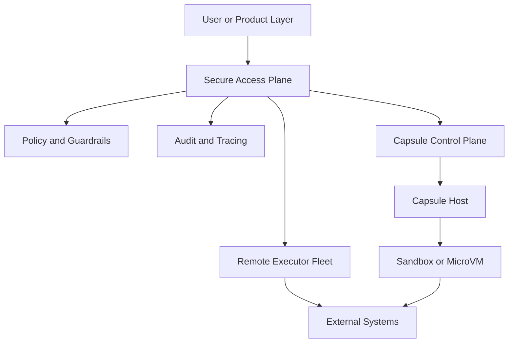
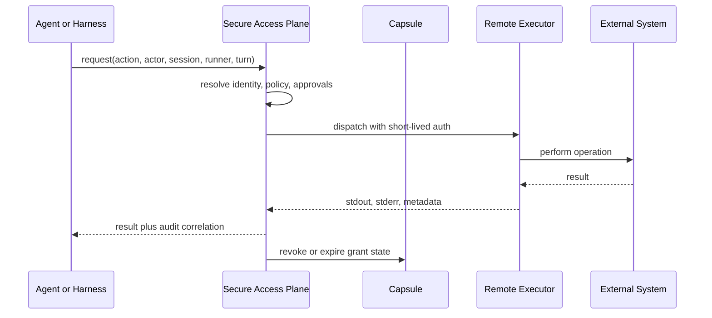
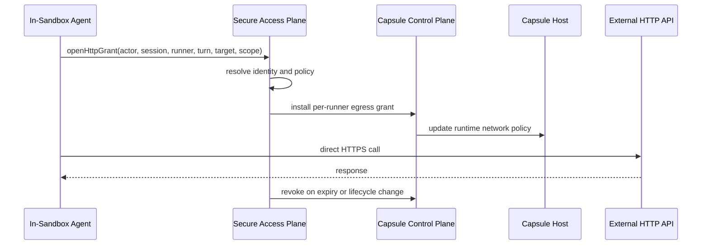
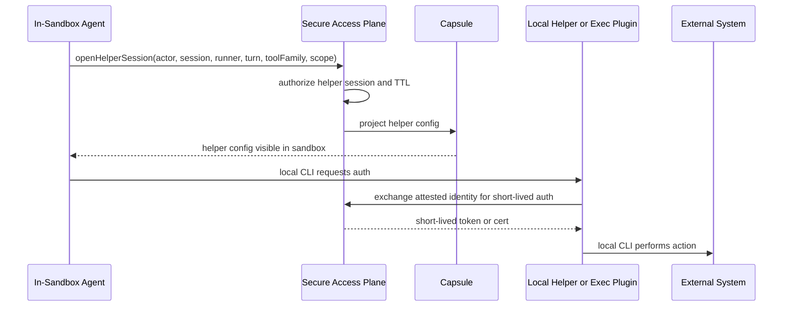
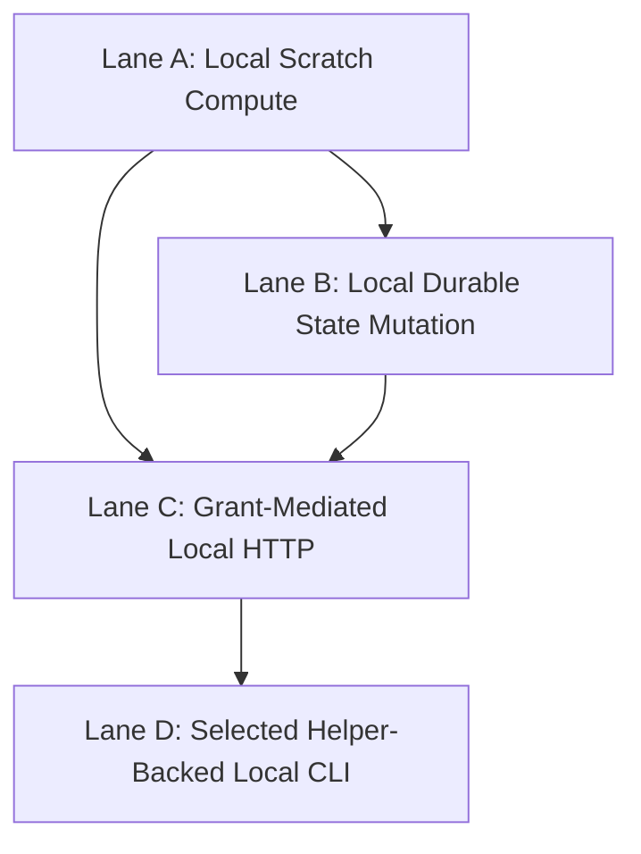

# Capsule Secure Access Plane One-Pager

This document is a compact architecture summary for Capsule's secure access
plane direction. It is intended to be read alongside
[secure-access-plane-future.md](secure-access-plane-future.md).

## Goal

Capsule needs a secure way to support long-lived agent sandboxes without making
durable authority ambient inside the sandbox.

The core design objective is:

> Keep the sandbox as compute, and keep identity, grants, approvals, and audit
> in a separate secure access authority.

## Core Design Principles

- long-lived sessions are acceptable
- long-lived grants are not
- runtime isolation is necessary but not sufficient
- privileged access should be explicit, narrow, and revocable
- CLI-heavy workflows must be treated as first-class
- direct in-sandbox access should be an exception, not the ambient default

## Target Architecture

### Responsibilities by Layer

| Layer | Responsibilities |
| --- | --- |
| Secure access plane | identity, grants, approvals, remote execution, helper sessions, audit |
| Capsule runtime | runner lifecycle, workload attestation, network policy hooks, helper projection |
| Sandbox | compute, local tools, bounded execution context |
| External systems | cloud APIs, SaaS APIs, internal debug surfaces |

## Access Lanes

| Lane | Description | Default Use |
| --- | --- | --- |
| 0. Local compute | local execution without privileged external authority | always available |
| 1. Remote broker execution | privileged action runs on trusted compute and streams result back | default for credentialed CLI and high-risk access |
| 2. Direct HTTP grants | sandbox receives bounded direct HTTP capability | when in-sandbox HTTP fidelity matters |
| 3. Local auth helper sessions | sandbox runs local CLI with short-lived helper-backed auth | small set of supported families only |

## Recommended Default Flow

### Why this is the default

- strongest protection against credential exfiltration
- simplest audit and approval boundary
- best fit for CLI-heavy workflows
- avoids embedding provider-specific auth logic into Capsule

## Direct HTTP Grant Flow

### Good fit

- REST and GraphQL calls
- bounded in-sandbox HTTP
- cases where direct local call semantics matter

### Not a good fit

- arbitrary privileged CLIs
- SDKs that rely on local credential discovery
- metadata and helper-heavy auth chains

## Local Helper Session Flow

### Constraints

- highest implementation complexity
- requires stronger harness vs generated-code separation
- should be used only for a small number of explicit tool families

## Controls the System Must Provide

### Runtime controls

- VM or strong sandbox isolation
- unprivileged user and process restrictions
- seccomp or equivalent syscall filtering
- filesystem isolation and protected helper paths
- restricted localhost and helper sockets

### Network controls

- per-runner egress policy
- destination allowlists
- method and path restrictions for REST when needed
- per-binary matching where possible
- short-lived grant install and revoke operations

### Identity and grant controls

- attested runner identity
- user and virtual identity resolution
- session-bound, runner-bound, and ideally turn-bound grants
- lifecycle-aware revocation on pause, resume, fork, and migration

### Credential controls

- no durable credentials in sandbox by default
- helper-based short-lived authority only
- no long-lived refresh tokens or broad reusable caches

## If Capsule Drops Remote Execution

Removing remote execution simplifies topology, but it does not remove the core
authority problem.

### What simplifies

- no remote executor fleet
- no brokered CLI streaming
- no split between local workspace state and remote command state

### What gets harder

- safe local CLI authentication
- protection of helper surfaces
- support for arbitrary CLI-heavy workflows
- keeping persistent local state from becoming ambient authority

## Revised Default Model for Long-Lived Sandboxes

If Capsule removes remote execution, the default model should be revised.

### Interpretation

| Lane | Meaning |
| --- | --- |
| Lane A | safe default for local code, file transforms, tests, and ephemeral compute |
| Lane B | more sensitive local mutations to persistent workspace or runtime state |
| Lane C | explicit local HTTP access through grants |
| Lane D | rare helper-backed local CLI families only |

This model is more realistic than treating plain local execution as the full
default for long-lived sandboxes.

## Recommended Direction

### Preferred broad architecture

- keep remote broker execution
- keep it as the default for privileged access
- use direct HTTP grants and helper sessions as narrow exceptions

### Coherent narrowed architecture

If Capsule drops remote execution:

- keep the secure access plane
- narrow the supported product scope deliberately
- treat local scratch compute as the default
- treat durable local mutation as more sensitive than scratch compute
- support only bounded HTTP and a small set of helper-backed CLI families

## Bottom Line

The secure access plane should remain the semantic authority.

Capsule should either:

- keep remote execution for broad privileged-access coverage, or
- remove remote execution only alongside a deliberate narrowing of scope and a
  stronger local-control model for long-lived sandboxes

The system should not assume that the original lane-zero model is enough for
long-lived sandboxes with persistent state.
